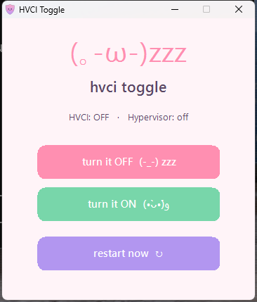

<p align="center">
  
</p>

<h1 align="center">HVCI Toggle</h1>

<p align="center">A tiny one-click app to turn Windows <b>Memory Integrity (HVCI)</b> on or off.</p>

<p align="center">
  
</p>

## What it does

Nothing hidden: it changes exactly two things.

| Setting | OFF | ON |
|---|---|---|
| `HKLM\SYSTEM\CurrentControlSet\Control\DeviceGuard\Scenarios\HypervisorEnforcedCodeIntegrity` → `Enabled` (DWORD) | `0` | `1` |
| `bcdedit /set hypervisorlaunchtype` | `off` | `auto` |

You need to restart before either change takes effect. The app has a restart button for that.

## Download

Two options that do the same thing:

- **`HVCI Toggle.exe`**: the GUI app. Get it from [Releases](../../releases). It asks for admin rights because it writes to `HKLM` and runs `bcdedit`.
- **[`hvci-toggle.bat`](hvci-toggle.bat)**: a plain-text batch version. Open it in Notepad to read it, then right-click → *Run as administrator*.

Each release lists its SHA256 hash, so you can check your download:

```powershell
Get-FileHash ".\HVCI Toggle.exe"
```

## Build it yourself

You don't need Visual Studio. Windows includes the C# compiler:

```bat
build.bat
```

This creates `bin\HVCI Toggle.exe` from [`src/HvciToggle.cs`](src/HvciToggle.cs).

## ⚠️ Heads-up

Memory Integrity is a Windows security feature. It blocks malicious or vulnerable drivers from running in the kernel. Turning it off can improve gaming performance or fix incompatible drivers, but it also **lowers your PC's protection**. Only turn it off if you have a reason to, and you can always switch it back on.

Turning it off also sets `hypervisorlaunchtype off`, which stops the Windows hypervisor. That disables **WSL2, Hyper-V, Windows Sandbox and some emulators** until you turn it back on.

## License

[MIT](LICENSE)
